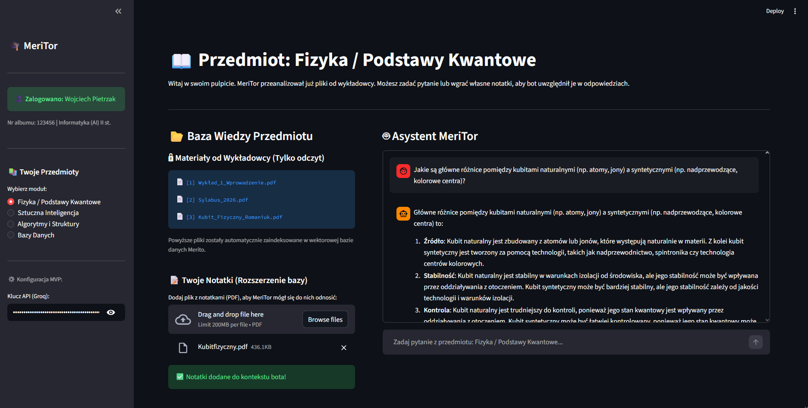

# 🎓 MeriTor – Asystent Dydaktyczny WSB Merito
**Repozytorium demonstracyjne (Proof of Concept) innowacji w obszarze EdTech**

*Powyżej: Działający interfejs wersji MVP (Streamlit + Llama-3.1).*
---

## 🎬 Pitch Video (YouTube)
Obejrzyj 1-minutowy materiał wideo, w którym prezentujemy problem, rozwiązanie i działanie MeriTora w praktyce.
👉 **[Obejrzyj Pitch Video MeriTor AI na YouTube](https://youtu.be/_TjhQzdeqro)**

---

## 📊 Prezentacja Biznesowa (Pitch Deck)
Pełna wizja biznesowa projektu, uzasadnienie wdrożenia oraz wyliczenia optymalizacji czasu pracy wykładowców znajdują się w oficjalnej prezentacji.
👉 **[Kliknij tutaj, aby zobaczyć Prezentację Projektu (PDF)](Prezentacja_MeriTor.pdf)**

---

## 🎯 Cel Projektu
**MeriTor** to dedykowany asystent AI dla studentów hybrydowych. Głównym założeniem jest stworzenie bezpiecznego, zamkniętego ekosystemu edukacyjnego opartego o architekturę **RAG** (Retrieval-Augmented Generation), który czerpie wiedzę **wyłącznie** z autoryzowanych materiałów uczelni (sylabusy, prezentacje wykładowców), całkowicie eliminując problem halucynacji modeli językowych.

## 🏗️ Architektura Docelowa (Produkcyjna)
Zgodnie z rygorystycznymi wymogami bezpieczeństwa, RODO oraz ochrony własności intelektualnej (IP) wykładowców WSB Merito, docelowa architektura (szczegółowo opisana w prezentacji) zakłada:
* **Orkiestracja:** LangChain do zarządzania agentami.
* **Baza Wiedzy:** Wektorowe Bazy Danych (ChromaDB) do lokalnego i błyskawicznego przeszukiwania tysięcy skryptów.
* **Prywatność:** Wykorzystanie modeli LLM hostowanych na serwerach uczelni, aby dane edukacyjne nigdy nie trenowały publicznych instancji sztucznej inteligencji.

## 🛠️ Stan Obecny: Repozytorium MVP (TRL 3)
Znajdujący się tutaj kod `app.py` to wczesne MVP stworzone metodą Rapid Prototyping, aby udowodnić gotowość technologiczną logiki AI.
Wersja demonstracyjna opiera się na:
* **Frontend:** `Streamlit` (błyskawiczne renderowanie interfejsów analitycznych).
* **Przetwarzanie dokumentów:** `PyPDF` (parsowanie danych "w locie").
* **Logika AI:** Integracja z szybkim modelem `Llama-3.1-8b-instant` (poprzez API Groq) z wykorzystaniem techniki dynamicznego wstrzykiwania wiedzy (*Context Stuffing*).

## 🚀 Jak uruchomić lokalnie?
1. Sklonuj repozytorium: `git clone https://github.com/wojciechpietrzak02/MeriTor-MVP`
2. Zainstaluj wymagane pakiety: `pip install -r requirements.txt`
3. Uruchom aplikację: `streamlit run app.py`

---
*Projekt przygotowany przez: **Wojciech Pietrzak** | Student Informatyki (AI) II Stopnia | Uniwersytet WSB Merito*